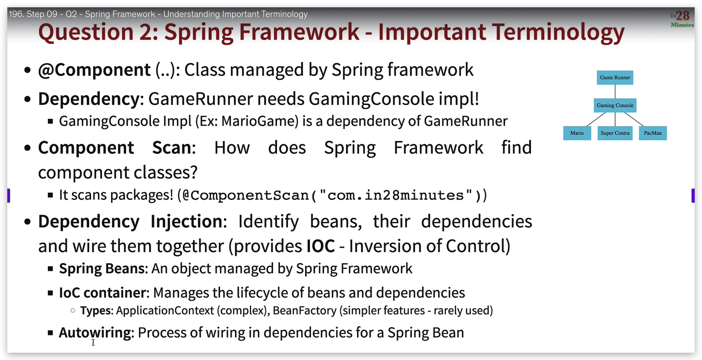
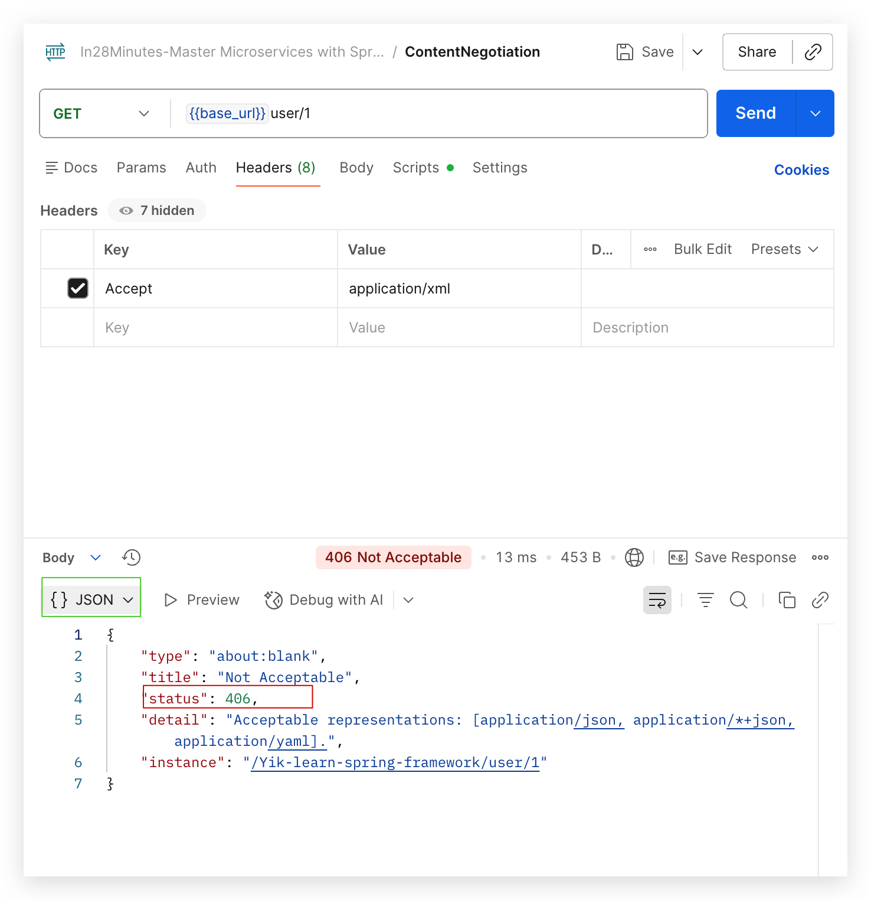
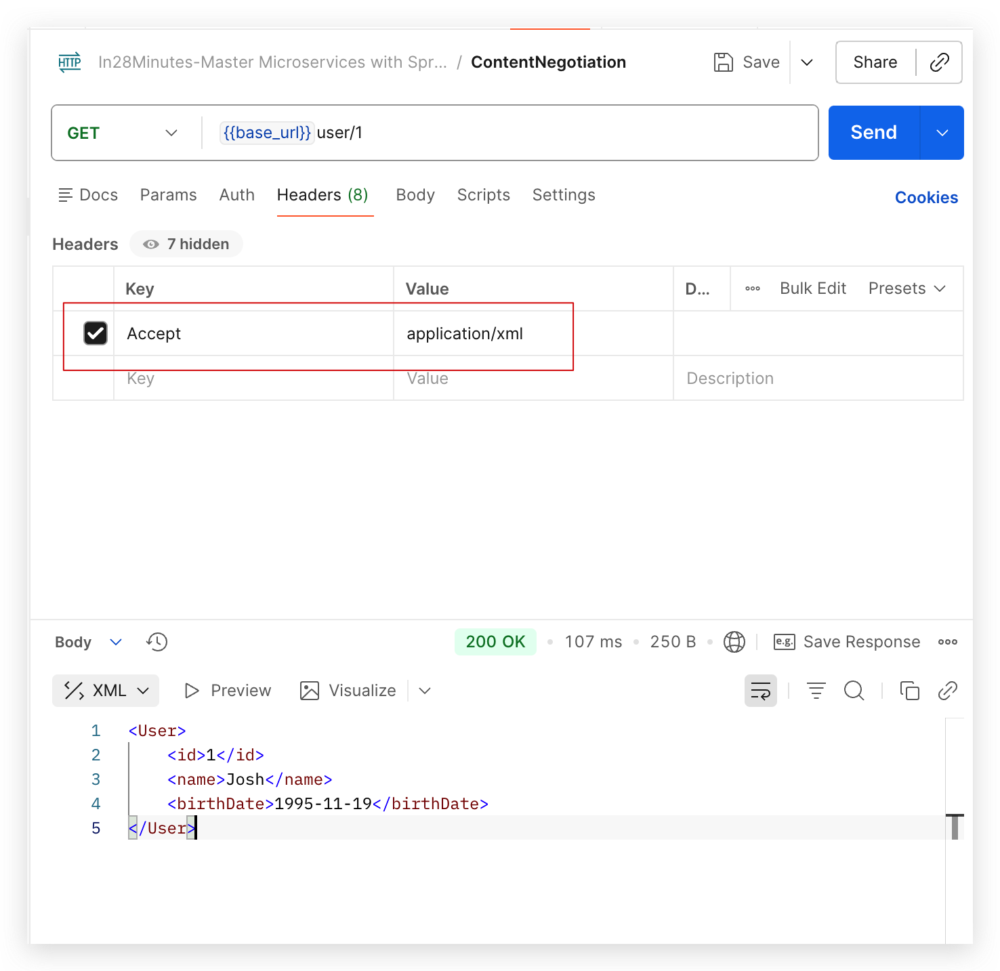
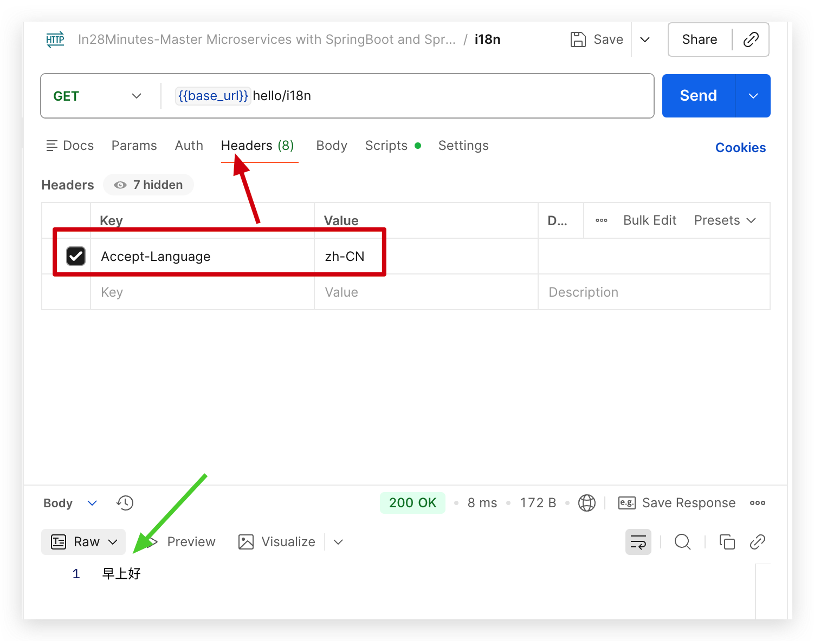
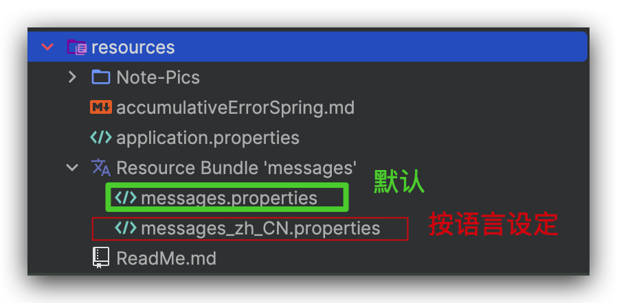

This is the Project for learning Spring Framework.
This is the code written while watching the in28minutes' course named: Master Microservices with Spring Boot and Spring Cloud.

Important terminology in Spring:



Content Negotiate 几点总结:

```java
  @PostMapping(value = "/user", produces = {"application/json","application/xml"}) // this will save and return the correct HTTP status code
    public ResponseEntity<User> saveUser(@Valid @RequestBody User user) {
        User savedUser = userService.save(user);
        URI uriLocation = ServletUriComponentsBuilder.fromCurrentRequest()
                .path("/{id}")
                .buildAndExpand(savedUser.getId())
                .toUri();
        //return ResponseEntity.created(null).build();
        return ResponseEntity.created(uriLocation)
                .build();
    }
```
1. 当如上代码中produces**没有**显式赋值时,默认返回是JSON数据,所以此时在postman请求header中加Accept=application/xml 会报错406, 如下图1
2. 当如上代码中produces**有**显式赋值(如上)时, 用户可指定以JSON或者是XML返回, XML返回如下图2


i18n 几点总结:
1. messages._${region_language}.properties 需要和application.properties在同一目录,即resources下
2. messages._${region_language}.properties 文件名里都是下划线underscore,而请求头里是连接符hyphen.
3. 

