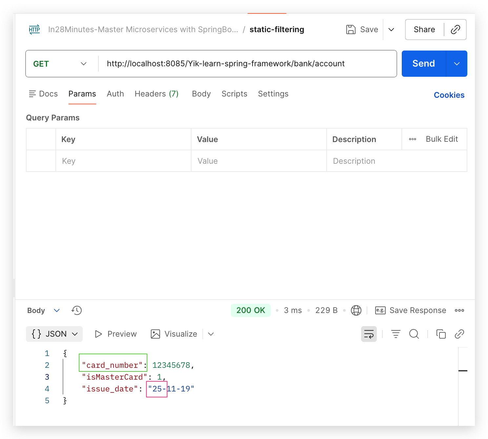
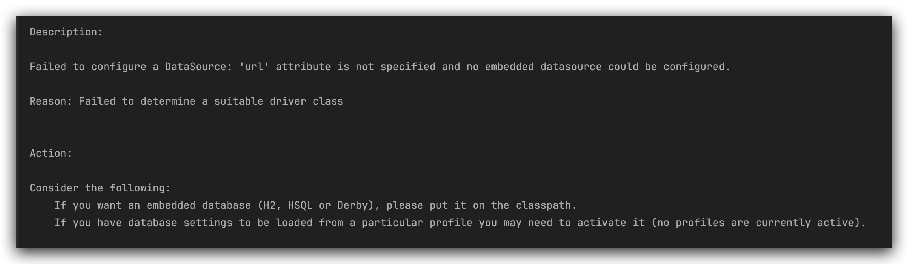
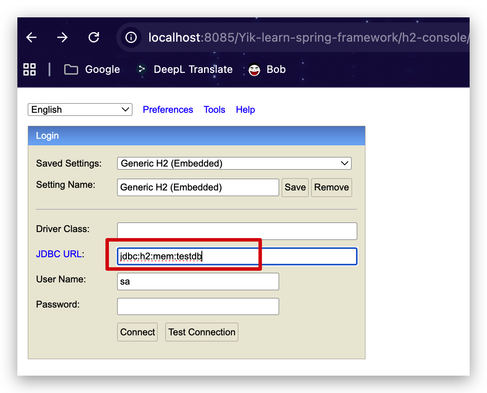
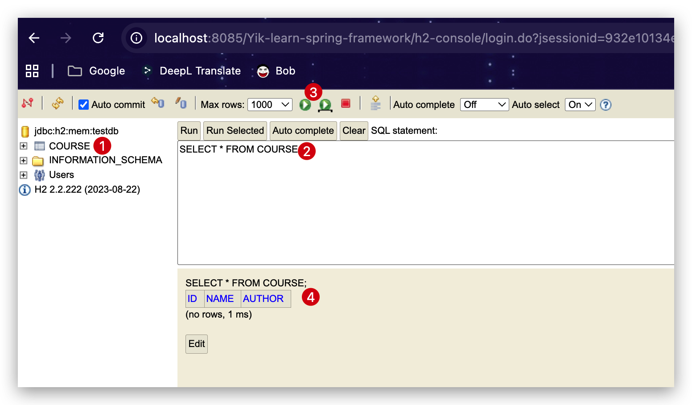

This is the Project for learning Spring Framework.
This is the code written while watching the in28minutes' course named: Master Microservices with Spring Boot and Spring
Cloud.

Important terminology in Spring:


Content Negotiate 几点总结:

```java

@PostMapping(value = "/user", produces = {"application/json", "application/xml"})
// this will save and return the correct HTTP status code
public ResponseEntity<User> saveUser(@Valid @RequestBody User user) {
    User savedUser = userService.save(user);
    URI uriLocation = ServletUriComponentsBuilder.fromCurrentRequest()
            .path("/{id}")
            .buildAndExpand(savedUser.getId())
            .toUri();
    //return ResponseEntity.created(null).build();
    return ResponseEntity.created(uriLocation)
            .build();
}
```

1. 当如上代码中produces**没有**显式赋值时,默认返回是JSON数据,所以此时在postman请求header中加Accept=application/xml
   会报错406, 如下图1
2. 当如上代码中produces**有**显式赋值(如上)时, 用户可指定以JSON或者是XML返回, XML返回如下图2
   
   
   i18n 几点总结:
1. messages._${region_language}.properties 需要和application.properties在同一目录,即resources下
2. messages._${region_language}.properties 文件名里都是下划线underscore,而请求头里是连接符hyphen.
3.


static filtering:
之所以叫静态过滤是因为过滤是发生在DAO上的, 不同API调用都是运用的同样的过滤规则,所以返回同样的字段, 所以叫"静态"

 ```java

@JsonIgnoreProperties({"name", "phone"})  //如果这里要ignore number， 应该把card_number加到数组里
public class BankAccount {
    private String name;
    @JsonProperty("card_number")
    private Long number;
    private String phone;
    @JsonIgnore
    private String address;
    private int isMasterCard;
    @JsonFormat(pattern = "yy-MM-dd")
    @JsonProperty("issue_date")
    private LocalDate date;
}
```

@JsonIgnoreProperties & @JsonIgnore 过滤掉三个字段<br/>
@JsonFormat 的pattern指定是的日期格式为25-11-19<br/>
@JsonProperty重命名字段


Dynamic filtering:
但是试想, 有可能在特定场景下,你需要根据不同的REST API返回相同bean的不同attributes. 这时你就需要dynamic filtering
根据上面静态的filter是定义到DAO,你可能也已经猜到,要想做到动态过滤 i.e. API- specific,那么filter就需要定义到与API本身耦合.

引入JDBC, Springboot JPA, mysql 的dependency后,启动项目会报错如下:

这是因为根据auto configure & component scan 知道配置了JDBC相关的Jar,但是又没有定义DB, 所以要定义才不会报错.
按照错误提示,在application.properties加入下面配置后就不会报错:

 ```properties
spring.datasource.url=jdbc:h2:mem:testdb
```

启动后访问:
http://localhost:8085/Yik-learn-spring-framework/h2-console/
会看见h2的控制台,然后将`application.properties`里配置的url填在`jdbc url`里,其他信息不懂,点击 **connect**就能连接

并且可以看见刚刚创建的表course 以及查询里面的内容


1. CourseJdbcRepository class
2. CourseCommandLineRunner